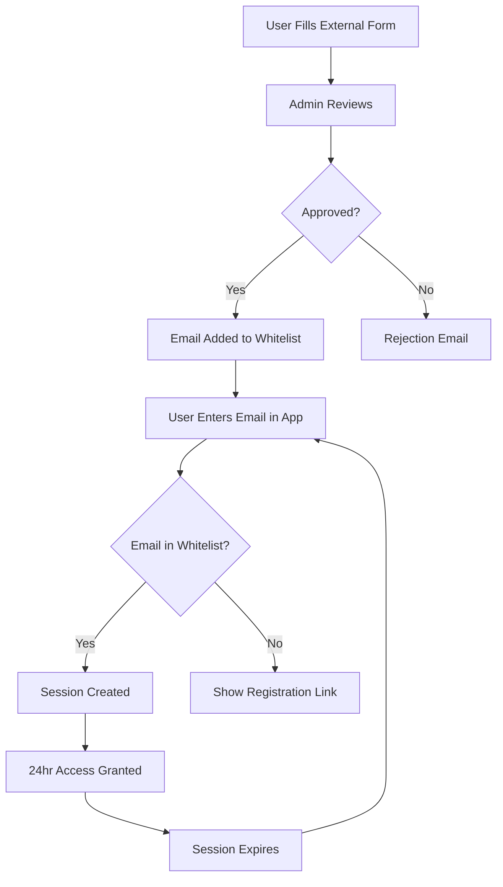

# Access Control Documentation - Yomnai Backend

## 📋 Overview

Yomnai implements a **passwordless, email-based whitelist** access control system. Users register through an external form (Google Forms, Typeform, etc.), and administrators add their emails to the whitelist. No passwords, no OAuth, just simple email verification.

---

## 🔐 Access Control Philosophy

### Why No Passwords?

1. **User Experience**
   - No password fatigue
   - No forgotten passwords
   - No reset flows needed
   - One-click access

2. **Security Benefits**
   - No password breaches
   - No weak passwords
   - No credential stuffing
   - Controlled access list

3. **Administrative Simplicity**
   - Easy bulk management
   - CSV import/export
   - No password policies
   - Clear audit trail

### Access Flow



---

## 🚪 User Access Flow

### 1. Registration Process (External)

Users DO NOT register in the app. Instead:

```
1. User visits registration form (Google Forms/Typeform)
2. Fills out:
   - Email address
   - Company name
   - Use case (optional)
   - Agreement to terms
3. Form submission triggers notification to admin
4. Admin reviews and approves/rejects
5. If approved, email added to whitelist
```

### 2. First Access

```typescript
// User enters email
const email = "john.doe@company.sa"

// Frontend calls API
POST /api/auth/verify-access
{
  "email": "john.doe@company.sa"
}

// If authorized
{
  "authorized": true,
  "session_id": "550e8400-e29b-41d4",
  "expires_at": "2024-01-02T10:00:00Z"
}

// If not authorized
{
  "authorized": false,
  "message": "Access restricted",
  "registration_url": "https://forms.google.com/register"
}
```

### 3. Session Management

Sessions are created with:
- **24-hour expiration** (configurable)
- **Unique session ID** (UUID v4)
- **Activity tracking** (last access time)
- **IP logging** (for security audit)

---

## 🛠️ Administration Tools

### 1. CLI Admin Tool

```python
# admin_cli.py
import click
import sqlite3
from datetime import datetime
import csv

@click.group()
def cli():
    """Yomnai Admin CLI"""
    pass

@cli.command()
@click.argument('email')
@click.option('--notes', help='Admin notes')
def add_user(email, notes):
    """Add a single user to whitelist"""
    conn = sqlite3.connect('data/yomnai.db')
    cursor = conn.cursor()

    try:
        cursor.execute("""
            INSERT INTO authorized_users
            (email, authorized_by, notes, authorized_at)
            VALUES (?, ?, ?, ?)
        """, (email, 'admin', notes, datetime.now()))
        conn.commit()
        click.echo(f"✅ Added {email} to whitelist")
    except sqlite3.IntegrityError:
        click.echo(f"❌ {email} already exists")
    finally:
        conn.close()

@cli.command()
@click.argument('csv_file', type=click.Path(exists=True))
def bulk_add(csv_file):
    """Add multiple users from CSV file"""
    conn = sqlite3.connect('data/yomnai.db')
    cursor = conn.cursor()

    with open(csv_file, 'r') as f:
        reader = csv.DictReader(f)
        added = 0
        skipped = 0

        for row in reader:
            email = row.get('email')
            if not email:
                continue

            try:
                cursor.execute("""
                    INSERT INTO authorized_users
                    (email, authorized_by, metadata, authorized_at)
                    VALUES (?, ?, ?, ?)
                """, (
                    email,
                    'bulk_import',
                    json.dumps({
                        'company': row.get('company', ''),
                        'source': row.get('source', 'csv_import')
                    }),
                    datetime.now()
                ))
                added += 1
            except sqlite3.IntegrityError:
                skipped += 1

        conn.commit()
        click.echo(f"✅ Added {added} users")
        click.echo(f"⚠️ Skipped {skipped} duplicates")

    conn.close()

@cli.command()
@click.argument('email')
def remove_user(email):
    """Remove user from whitelist"""
    conn = sqlite3.connect('data/yomnai.db')
    cursor = conn.cursor()

    cursor.execute("""
        UPDATE authorized_users
        SET status = 'blocked'
        WHERE email = ?
    """, (email,))

    if cursor.rowcount > 0:
        click.echo(f"✅ Blocked {email}")
    else:
        click.echo(f"❌ {email} not found")

    conn.commit()
    conn.close()

@cli.command()
def list_users():
    """List all authorized users"""
    conn = sqlite3.connect('data/yomnai.db')
    cursor = conn.cursor()

    cursor.execute("""
        SELECT email, status, last_access, access_count
        FROM authorized_users
        ORDER BY last_access DESC
    """)

    users = cursor.fetchall()

    click.echo("\nAuthorized Users:")
    click.echo("-" * 80)
    click.echo(f"{'Email':<40} {'Status':<10} {'Last Access':<20} {'Count':<10}")
    click.echo("-" * 80)

    for user in users:
        email, status, last_access, count = user
        last = last_access or "Never"
        click.echo(f"{email:<40} {status:<10} {last:<20} {count:<10}")

    conn.close()

@cli.command()
def stats():
    """Show usage statistics"""
    conn = sqlite3.connect('data/yomnai.db')
    cursor = conn.cursor()

    # Total users
    cursor.execute("SELECT COUNT(*) FROM authorized_users WHERE status = 'active'")
    total_users = cursor.fetchone()[0]

    # Active sessions
    cursor.execute("""
        SELECT COUNT(*) FROM sessions
        WHERE is_active = 1 AND expires_at > datetime('now')
    """)
    active_sessions = cursor.fetchone()[0]

    # Today's activity
    cursor.execute("""
        SELECT COUNT(DISTINCT email) FROM access_logs
        WHERE date(created_at) = date('now')
    """)
    today_users = cursor.fetchone()[0]

    # This month's uploads
    cursor.execute("""
        SELECT COUNT(*) FROM uploads
        WHERE date(created_at) >= date('now', 'start of month')
    """)
    month_uploads = cursor.fetchone()[0]

    click.echo("\n📊 Yomnai Statistics")
    click.echo("-" * 40)
    click.echo(f"Total Authorized Users: {total_users}")
    click.echo(f"Active Sessions: {active_sessions}")
    click.echo(f"Users Today: {today_users}")
    click.echo(f"Uploads This Month: {month_uploads}")

    conn.close()

if __name__ == '__main__':
    cli()
```

### 2. Usage Examples

```bash
# Add single user
python admin_cli.py add-user john.doe@company.sa --notes "Premium customer"

# Bulk import from CSV
python admin_cli.py bulk-add users.csv

# Remove access
python admin_cli.py remove-user suspicious@user.com

# List all users
python admin_cli.py list-users

# Show statistics
python admin_cli.py stats
```

### 3. CSV Format for Bulk Import

```csv
email,company,source,plan
john.doe@company.sa,SABIC,google_form,premium
sarah.ahmed@firm.sa,Aramco,typeform,enterprise
mohammed.ali@startup.sa,TechCo,website,basic
```

---

## 🔒 Security Measures

### 1. Session Security

```python
# Session configuration
SESSION_TIMEOUT_HOURS = 24  # Expires after 24 hours
SESSION_ID_LENGTH = 36      # UUID v4 format
MAX_SESSIONS_PER_USER = 5   # Limit concurrent sessions
```

### 2. Rate Limiting

```python
# Rate limit configuration
class RateLimiter:
    def __init__(self):
        self.limits = {
            "verify_access": {"per_hour": 10, "per_day": 20},
            "upload": {"per_hour": 20, "per_day": 50},
            "analysis": {"per_hour": 30, "per_day": 100},
            "chat": {"per_hour": 100, "per_day": 500}
        }

    async def check_limit(
        self,
        email: str,
        endpoint: str,
        db: AsyncSession
    ) -> bool:
        """Check if user has exceeded rate limit"""
        # Check hourly limit
        hour_ago = datetime.now() - timedelta(hours=1)
        result = await db.execute(
            select(func.count(RateLimit.email))
            .where(
                RateLimit.email == email,
                RateLimit.endpoint == endpoint,
                RateLimit.window_start >= hour_ago
            )
        )
        hour_count = result.scalar()

        if hour_count >= self.limits[endpoint]["per_hour"]:
            return False

        # Check daily limit
        day_ago = datetime.now() - timedelta(days=1)
        result = await db.execute(
            select(func.count(RateLimit.email))
            .where(
                RateLimit.email == email,
                RateLimit.endpoint == endpoint,
                RateLimit.window_start >= day_ago
            )
        )
        day_count = result.scalar()

        if day_count >= self.limits[endpoint]["per_day"]:
            return False

        # Log the request
        rate_entry = RateLimit(
            email=email,
            endpoint=endpoint,
            window_start=datetime.now()
        )
        db.add(rate_entry)
        await db.commit()

        return True
```

### 3. IP Tracking & Blocking

```python
# IP-based security
class IPSecurity:
    def __init__(self):
        self.blocked_ips = set()
        self.suspicious_threshold = 10  # Failed attempts

    async def check_ip(
        self,
        ip_address: str,
        db: AsyncSession
    ) -> bool:
        """Check if IP is allowed"""
        if ip_address in self.blocked_ips:
            return False

        # Check failed attempts
        hour_ago = datetime.now() - timedelta(hours=1)
        result = await db.execute(
            select(func.count(AccessLog.log_id))
            .where(
                AccessLog.ip_address == ip_address,
                AccessLog.action == "login_failed",
                AccessLog.created_at >= hour_ago
            )
        )
        failed_count = result.scalar()

        if failed_count >= self.suspicious_threshold:
            self.blocked_ips.add(ip_address)

            # Log security event
            await db.execute(
                insert(AccessLog).values(
                    ip_address=ip_address,
                    action="ip_blocked",
                    error_message=f"Blocked after {failed_count} failed attempts"
                )
            )
            await db.commit()
            return False

        return True
```

### 4. Audit Logging

```python
# Comprehensive audit logging
class AuditLogger:
    @staticmethod
    async def log_access(
        db: AsyncSession,
        email: str,
        action: str,
        details: dict = None
    ):
        """Log all access attempts"""
        log_entry = AccessLog(
            email=email,
            action=action,
            request_data=details,
            created_at=datetime.now()
        )
        db.add(log_entry)
        await db.commit()

    @staticmethod
    async def log_admin_action(
        db: AsyncSession,
        admin_email: str,
        action: str,
        target_email: str = None,
        details: str = None
    ):
        """Log administrative actions"""
        admin_log = AdminAction(
            admin_email=admin_email,
            action_type=action,
            target_email=target_email,
            description=details,
            created_at=datetime.now()
        )
        db.add(admin_log)
        await db.commit()
```

---

## 📊 Monitoring & Analytics

### 1. User Activity Dashboard

```sql
-- Daily active users
SELECT
    DATE(created_at) as date,
    COUNT(DISTINCT email) as unique_users,
    COUNT(*) as total_actions
FROM access_logs
WHERE created_at >= datetime('now', '-30 days')
GROUP BY DATE(created_at)
ORDER BY date DESC;

-- Top users by activity
SELECT
    email,
    COUNT(*) as action_count,
    MAX(created_at) as last_activity
FROM access_logs
WHERE created_at >= datetime('now', '-7 days')
GROUP BY email
ORDER BY action_count DESC
LIMIT 20;

-- Failed access attempts
SELECT
    email,
    COUNT(*) as failed_attempts,
    MAX(created_at) as last_attempt
FROM access_logs
WHERE action = 'login_failed'
  AND created_at >= datetime('now', '-24 hours')
GROUP BY email
HAVING failed_attempts > 3
ORDER BY failed_attempts DESC;
```

### 2. Security Monitoring

```python
# Security monitoring service
class SecurityMonitor:
    async def check_anomalies(self, db: AsyncSession):
        """Check for security anomalies"""
        anomalies = []

        # Check for multiple IPs per user
        result = await db.execute("""
            SELECT email, COUNT(DISTINCT ip_address) as ip_count
            FROM sessions
            WHERE created_at >= datetime('now', '-1 hour')
            GROUP BY email
            HAVING ip_count > 3
        """)

        for row in result:
            anomalies.append({
                "type": "multiple_ips",
                "email": row.email,
                "details": f"{row.ip_count} different IPs"
            })

        # Check for rapid session creation
        result = await db.execute("""
            SELECT email, COUNT(*) as session_count
            FROM sessions
            WHERE created_at >= datetime('now', '-10 minutes')
            GROUP BY email
            HAVING session_count > 5
        """)

        for row in result:
            anomalies.append({
                "type": "rapid_sessions",
                "email": row.email,
                "details": f"{row.session_count} sessions in 10 minutes"
            })

        return anomalies
```

---

## 🔧 Configuration Options

### 1. Environment Variables

```bash
# .env configuration for access control

# Session Configuration
SESSION_TIMEOUT_HOURS=24          # How long sessions last
MAX_SESSIONS_PER_USER=5           # Concurrent session limit
SESSION_CLEANUP_INTERVAL=3600     # Cleanup job frequency (seconds)

# Rate Limiting
RATE_LIMIT_ENABLED=true
RATE_LIMIT_PER_HOUR=20
RATE_LIMIT_PER_DAY=100

# Security
IP_BLOCKING_ENABLED=true
FAILED_ATTEMPTS_THRESHOLD=10
IP_BLOCK_DURATION_HOURS=24

# Registration
REGISTRATION_URL=https://forms.google.com/your-form
ADMIN_NOTIFICATION_EMAIL=admin@yomnai.com

# Audit
AUDIT_LOG_RETENTION_DAYS=90
DETAILED_LOGGING=true
```

### 2. Customizable Messages

```python
# Custom messages for different scenarios
MESSAGES = {
    "unauthorized": "Access restricted. Please register at {registration_url}",
    "blocked": "Your access has been temporarily blocked. Contact support.",
    "expired": "Session expired. Please login again.",
    "rate_limited": "Too many requests. Please try again later.",
    "maintenance": "System under maintenance. Please try again later."
}
```

---

## 🚀 Advanced Features

### 1. Magic Links (Optional Enhancement)

```python
# Magic link implementation
class MagicLinkService:
    async def send_magic_link(
        self,
        email: str,
        db: AsyncSession
    ):
        """Send one-time login link"""
        # Generate token
        token = secrets.token_urlsafe(32)
        expires_at = datetime.now() + timedelta(minutes=15)

        # Store token
        await db.execute("""
            INSERT INTO magic_links
            (token, email, expires_at)
            VALUES (?, ?, ?)
        """, (token, email, expires_at))

        # Send email (implement email service)
        login_url = f"https://app.yomnai.com/login?token={token}"
        await send_email(
            to=email,
            subject="Your Yomnai Login Link",
            body=f"Click here to login: {login_url}\n\nThis link expires in 15 minutes."
        )

    async def verify_magic_link(
        self,
        token: str,
        db: AsyncSession
    ) -> Optional[str]:
        """Verify magic link and create session"""
        result = await db.execute("""
            SELECT email FROM magic_links
            WHERE token = ?
              AND expires_at > datetime('now')
              AND used = 0
        """, (token,))

        email = result.scalar()
        if email:
            # Mark as used
            await db.execute("""
                UPDATE magic_links
                SET used = 1
                WHERE token = ?
            """, (token,))

            # Create session
            return await AuthService.create_session(db, email)

        return None
```

### 2. Two-Factor Authentication (Optional)

```python
# Simple 2FA via email code
class TwoFactorAuth:
    async def send_code(
        self,
        email: str,
        db: AsyncSession
    ):
        """Send 6-digit code to email"""
        code = str(random.randint(100000, 999999))
        expires_at = datetime.now() + timedelta(minutes=5)

        # Store code
        await db.execute("""
            INSERT INTO verification_codes
            (email, code, expires_at)
            VALUES (?, ?, ?)
        """, (email, code, expires_at))

        # Send email
        await send_email(
            to=email,
            subject="Your Yomnai Verification Code",
            body=f"Your verification code is: {code}\n\nThis code expires in 5 minutes."
        )

    async def verify_code(
        self,
        email: str,
        code: str,
        db: AsyncSession
    ) -> bool:
        """Verify 2FA code"""
        result = await db.execute("""
            SELECT 1 FROM verification_codes
            WHERE email = ?
              AND code = ?
              AND expires_at > datetime('now')
              AND used = 0
        """, (email, code))

        if result.scalar():
            # Mark as used
            await db.execute("""
                UPDATE verification_codes
                SET used = 1
                WHERE email = ? AND code = ?
            """, (email, code))
            return True

        return False
```

---

## 📋 Compliance & Privacy

### GDPR Compliance

```python
# Data privacy utilities
class PrivacyCompliance:
    @staticmethod
    async def export_user_data(email: str, db: AsyncSession):
        """Export all user data (GDPR right to access)"""
        data = {
            "user_info": await db.execute(
                "SELECT * FROM authorized_users WHERE email = ?", (email,)
            ).fetchone(),
            "sessions": await db.execute(
                "SELECT * FROM sessions WHERE email = ?", (email,)
            ).fetchall(),
            "uploads": await db.execute(
                "SELECT * FROM uploads WHERE email = ?", (email,)
            ).fetchall(),
            "messages": await db.execute(
                "SELECT * FROM chat_messages WHERE email = ?", (email,)
            ).fetchall()
        }
        return data

    @staticmethod
    async def delete_user_data(email: str, db: AsyncSession):
        """Delete all user data (GDPR right to erasure)"""
        # Delete in correct order (foreign key constraints)
        await db.execute("DELETE FROM chat_messages WHERE email = ?", (email,))
        await db.execute("DELETE FROM analysis_results WHERE email = ?", (email,))
        await db.execute("DELETE FROM uploads WHERE email = ?", (email,))
        await db.execute("DELETE FROM sessions WHERE email = ?", (email,))
        await db.execute("DELETE FROM access_logs WHERE email = ?", (email,))
        await db.execute("DELETE FROM authorized_users WHERE email = ?", (email,))
        await db.commit()
```

---

## 🎯 Best Practices

### 1. Regular Maintenance

```bash
# Daily maintenance script
#!/bin/bash

# Clean expired sessions
sqlite3 yomnai.db "DELETE FROM sessions WHERE expires_at < datetime('now')"

# Archive old logs
sqlite3 yomnai.db "DELETE FROM access_logs WHERE created_at < datetime('now', '-90 days')"

# Vacuum database
sqlite3 yomnai.db "VACUUM"

# Backup database
cp yomnai.db "backups/yomnai_$(date +%Y%m%d).db"
```

### 2. Security Checklist

- ✅ Use HTTPS in production
- ✅ Implement rate limiting
- ✅ Log all access attempts
- ✅ Regular security audits
- ✅ Backup user data
- ✅ Monitor for anomalies
- ✅ Update dependencies regularly
- ✅ Review access logs weekly

### 3. User Communication

```python
# Email templates
TEMPLATES = {
    "welcome": """
        Welcome to Yomnai!

        Your email has been approved for access.
        Simply enter your email at https://app.yomnai.com to get started.

        No password needed - just your email!
    """,

    "blocked": """
        Your Yomnai access has been temporarily blocked.

        This may be due to unusual activity or policy violations.
        Please contact support@yomnai.com for assistance.
    """,

    "expired": """
        Your Yomnai session has expired.

        For security, sessions last 24 hours.
        Simply login again with your email to continue.
    """
}
```

---

## 🔍 Troubleshooting

### Common Issues

| Issue | Solution |
|-------|----------|
| User can't access | Check email in whitelist, check status is 'active' |
| Session expires early | Verify SESSION_TIMEOUT_HOURS setting |
| Rate limit hit | Adjust limits or clear rate_limits table |
| IP blocked | Check blocked_ips, clear if false positive |
| Bulk import fails | Check CSV format, ensure no duplicates |

### Debug Queries

```sql
-- Check user status
SELECT * FROM authorized_users WHERE email = 'user@example.com';

-- View recent sessions
SELECT * FROM sessions WHERE email = 'user@example.com' ORDER BY created_at DESC;

-- Check access logs
SELECT * FROM access_logs WHERE email = 'user@example.com' ORDER BY created_at DESC LIMIT 20;

-- Find blocked IPs
SELECT DISTINCT ip_address, COUNT(*) as failures
FROM access_logs
WHERE action = 'login_failed'
GROUP BY ip_address
HAVING failures > 10;
```

---

## 📚 Summary

The Yomnai access control system provides:

- **Simple access** - Just email, no passwords
- **Secure** - Whitelist-based with audit trails
- **Manageable** - Easy admin tools
- **Scalable** - Handles many users efficiently
- **Privacy-focused** - Minimal data collection
- **Compliant** - GDPR ready

This approach balances security with user experience, making it perfect for controlled-access B2B applications.

---

*This documentation covers the complete access control implementation for Yomnai. For API details, see [API_DOCUMENTATION.md](./API_DOCUMENTATION.md).*