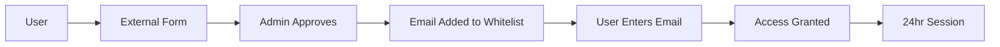

# Backend Architecture Overview - Yomnai Financial Analyst

## Executive Summary

**STATUS: ✅ IMPLEMENTATION ENHANCED** (October 1, 2025)
**UPDATE: 🚀 12-AGENT SYSTEM IMPLEMENTED** (Latest)

The Yomnai backend is a modern, privacy-first API service built with FastAPI that bridges the React frontend with an enhanced 12-agent AI system. It maintains 100% local processing while providing enterprise-grade performance and security through email-based access control.

Key Enhancement: The backend now features **12 specialized AI agents** - 6 for transaction analysis and 6 for financial statement analysis, providing comprehensive financial intelligence across all data types.

The backend is fully operational and running at `http://localhost:8001`. All endpoints support both agent sets and are ready for frontend integration.

---

## 🏗️ Architecture Decision

### Current State: Streamlit Monolith
- **Single file** (`app.py`) handles everything
- **Tightly coupled** UI and business logic
- **Session management** tied to Streamlit
- **No API endpoints** for external consumption
- **Limited scalability** and testing capabilities

### Target State: FastAPI Microservice
- **Separated concerns** - API backend + React frontend
- **RESTful + WebSocket** endpoints
- **Independent scaling** of frontend/backend
- **Proper session management** with SQLite
- **Testable** business logic layer

---

## 🎯 Why FastAPI?

### FastAPI vs Other Frameworks

| Feature | FastAPI | Flask | Django REST | Express.js |
|---------|---------|-------|-------------|------------|
| **Performance** | ⚡ Fastest | 🔄 Moderate | 🔄 Moderate | ⚡ Fast |
| **Async Support** | ✅ Native | ⚠️ Extension | ⚠️ Limited | ✅ Native |
| **Type Hints** | ✅ Built-in | ❌ Manual | ❌ Manual | ❌ TypeScript |
| **Auto Documentation** | ✅ OpenAPI | ⚠️ Extension | ⚠️ Extension | ⚠️ Extension |
| **WebSockets** | ✅ Native | ⚠️ Extension | ⚠️ Channels | ✅ Socket.io |
| **Learning Curve** | 📈 Moderate | 📉 Easy | 📈 Steep | 📈 Moderate |
| **Data Validation** | ✅ Pydantic | ❌ Manual | ❌ Manual | ❌ Manual |

### Why FastAPI Wins for Yomnai:
1. **Async by default** - Perfect for AI agent orchestration
2. **Pydantic validation** - Ensures data integrity
3. **Auto-generated docs** - OpenAPI/Swagger built-in
4. **WebSocket support** - Real-time agent updates
5. **Type safety** - Catches errors at development
6. **Fast** - Starlette + Uvicorn = high performance

---

## 📊 Technology Stack

### Core Technologies

```yaml
Backend Framework: FastAPI 0.104.1
ASGI Server: Uvicorn 0.24.0
Database (Structured): SQLite 3
Database (Vectors): ChromaDB 0.4.22
Session Management: Redis-like in SQLite
Authentication: Email whitelist (no passwords)
WebSockets: Native FastAPI
Task Queue: BackgroundTasks (built-in)
File Upload: Python-multipart
CORS: FastAPI middleware
Environment: Python 3.10+
```

### AI Integration (Enhanced - 12 Agents)

```yaml
LLM Runtime: Ollama (local)
Primary Model: qwen3-14b-32k
Router Model: gemma3:4b
Vision Model: qwen2.5:7b-vl
Embeddings: SentenceTransformers
Vector Store: ChromaDB
Agent Framework: Dual orchestrator system

Transaction Agents (6):
- ExpenseAgent: Spending analysis & categorization
- IncomeAgent: Revenue streams & stability
- FeeHunterAgent: Fee detection & savings
- BudgetAdvisorAgent: Cash flow & health scoring
- TrendAnalystAgent: Transaction patterns
- TransactionInvestigatorAgent: Complex searches

Financial Statement Agents (6):
- RatioAnalystAgent: Financial ratios & benchmarks
- ProfitabilityAgent: Margin analysis & optimization
- LiquidityAgent: Cash management & solvency
- FinancialTrendAgent: Performance trajectories
- RiskAssessmentAgent: Risk & compliance monitoring
- EfficiencyAgent: Operational metrics & productivity
```

---

## 🔐 Access Control Philosophy

### No Traditional Authentication
Unlike typical apps with username/password or OAuth, Yomnai uses a **pre-authorized email whitelist** system:

```python
# Traditional approach (NOT USED)
POST /register -> Create account
POST /login -> Username + Password -> JWT token

# Yomnai approach (SIMPLE & SECURE)
POST /verify-access -> Email only -> Session ID
```

### Why This Approach?
1. **Controlled access** - Only pre-approved users
2. **No password fatigue** - Users hate passwords
3. **Simple onboarding** - Enter email and go
4. **External registration** - Google Forms, Typeform, etc.
5. **Privacy-first** - Minimal data collection
6. **Easy management** - CSV import of emails

### User Flow


---

## 🏛️ System Architecture

### High-Level Architecture

```
┌─────────────────────────────────────────────┐
│            React Frontend                    │
│         (yomnai_frontend/)                  │
└─────────────┬───────────────────────────────┘
              │ HTTP/WebSocket
              ▼
┌─────────────────────────────────────────────┐
│           FastAPI Backend                    │
│         (yomnai_backend/)                   │
├─────────────────────────────────────────────┤
│ • REST API Endpoints                        │
│ • WebSocket Connections                     │
│ • Session Management                        │
│ • Access Control                            │
└─────────┬──────────────┬────────────────────┘
          │              │
          ▼              ▼
┌─────────────────┐ ┌─────────────────────────┐
│     SQLite      │ │      ChromaDB           │
│                 │ │                         │
│ • Sessions      │ │ • Vector embeddings    │
│ • Access logs   │ │ • Transaction data     │
│ • Auth users    │ │ • Semantic search      │
│ • Cache         │ │                         │
└─────────────────┘ └──────────┬──────────────┘
                               │
                               ▼
                    ┌─────────────────────────┐
                    │    AI Agent System      │
                    │                         │
                    │ • 6 Transaction Agents │
                    │ • 6 Financial Agents   │
                    │ • Orchestrator         │
                    │ • Ollama Integration   │
                    └─────────────────────────┘
```

### Component Interaction

```python
# 1. Frontend makes request
POST /api/analyze
{
    "session_id": "abc123",
    "query": "What are my top expenses?"
}

# 2. Backend validates session
session = validate_session(session_id)
if not session:
    return 401

# 3. Backend calls agent service
result = agent_service.analyze(
    query=query,
    session_id=session_id,
    agent_type="expense"
)

# 4. Agent queries ChromaDB
transactions = vector_store.search(
    query=query,
    session_id=session_id
)

# 5. Agent processes with Ollama
response = ollama.generate(
    prompt=build_prompt(transactions),
    model="qwen3-14b-32k"
)

# 6. Return to frontend
return {
    "response": response,
    "agent": "ExpenseAgent",
    "confidence": 0.95
}
```

---

## 🚀 Key Features

### 1. RESTful API Endpoints
- **File upload** with intelligent parsing
- **Chat interface** with agent routing
- **Analysis triggers** for all 12 agents
- **Data retrieval** for transactions/statements
- **Session management** endpoints

### 2. WebSocket Support
- **Real-time agent updates** during analysis
- **Live chat streaming** for responses
- **Progress indicators** for long operations
- **Multi-agent coordination** updates

### 3. Intelligent Caching
- **Query result caching** in SQLite
- **Session persistence** for 24 hours
- **File parsing cache** to avoid re-processing
- **Agent response cache** for common queries

### 4. Background Processing
- **Async file parsing** for large files
- **Parallel agent execution** when possible
- **Background vector indexing**
- **Scheduled cleanup** of old sessions

---

## 📁 Project Structure

```
yomnai_backend/
├── app/
│   ├── api/
│   │   ├── endpoints/
│   │   │   ├── auth.py          # Email verification
│   │   │   ├── upload.py        # File upload handling
│   │   │   ├── chat.py          # Chat interface
│   │   │   ├── analysis.py      # Agent analysis
│   │   │   ├── transactions.py  # Transaction data
│   │   │   └── financial.py     # Financial statements
│   │   ├── websocket.py         # WebSocket handlers
│   │   └── deps.py              # Dependencies
│   │
│   ├── core/
│   │   ├── config.py            # Configuration
│   │   ├── database.py          # Database connections
│   │   ├── security.py          # Session management
│   │   └── exceptions.py        # Custom exceptions
│   │
│   ├── services/
│   │   ├── agent_service.py     # Agent orchestration
│   │   ├── parser_service.py    # File parsing
│   │   ├── vector_service.py    # ChromaDB interface
│   │   ├── auth_service.py      # Access control
│   │   └── cache_service.py     # Caching layer
│   │
│   ├── models/
│   │   ├── schemas.py           # Pydantic models
│   │   ├── database.py          # SQLAlchemy models
│   │   └── responses.py         # Response models
│   │
│   ├── utils/
│   │   ├── validators.py        # Input validation
│   │   ├── formatters.py        # Output formatting
│   │   └── helpers.py           # Utility functions
│   │
│   └── main.py                  # FastAPI app entry
│
├── agents/                       # Migrated from src/ai/agents
│   ├── expense_agent.py
│   ├── income_agent.py
│   ├── fee_agent.py
│   ├── budget_agent.py
│   ├── trend_agent.py
│   └── transaction_agent.py
│
├── migrations/
│   ├── init_db.sql             # Database initialization
│   └── from_streamlit.py       # Migration script
│
├── tests/
│   ├── test_api/
│   ├── test_services/
│   └── test_agents/
│
├── data/
│   ├── chroma_db/              # Vector database
│   └── yomnai.db               # SQLite database
│
├── requirements.txt
├── .env.example
├── Dockerfile
└── README.md
```

---

## 🔄 Migration Strategy

### Phase 1: Setup (Week 1)
- Create FastAPI project structure
- Setup SQLite + ChromaDB connections
- Implement basic health check endpoint
- Configure CORS for React frontend

### Phase 2: Core APIs (Week 2)
- Implement file upload endpoint
- Create session management
- Build access control system
- Add basic chat endpoint

### Phase 3: Agent Integration (Week 3)
- Migrate agents from Streamlit
- Implement agent service layer
- Create analysis endpoints
- Add WebSocket support

### Phase 4: Frontend Integration (Week 4)
- Update React to call APIs
- Replace mock data
- Test end-to-end flows
- Performance optimization

### Phase 5: Deployment (Week 5)
- Docker containerization
- Documentation completion
- Security audit
- Production deployment

---

## 🎯 Design Principles

### 1. Privacy First
- **No cloud services** - Everything runs locally
- **No external APIs** - All AI models local
- **Minimal data collection** - Only email for access
- **Session-based** - No permanent user data

### 2. Performance Optimized
- **Async operations** - Non-blocking I/O
- **Intelligent caching** - Reduce redundant processing
- **Lazy loading** - Load only what's needed
- **Connection pooling** - Efficient database access

### 3. Developer Friendly
- **Clear structure** - Logical organization
- **Type hints** - Better IDE support
- **Auto documentation** - OpenAPI/Swagger
- **Comprehensive logging** - Easy debugging

### 4. Maintainable
- **Modular design** - Easy to extend
- **Service layer** - Business logic separation
- **Dependency injection** - Testable code
- **Configuration management** - Environment-based

---

## 🚦 Success Metrics

### Performance Targets
- **API response time**: < 200ms (average)
- **File upload**: < 5 seconds for 10MB
- **Agent analysis**: < 2 seconds per agent
- **WebSocket latency**: < 100ms
- **Concurrent users**: 100+

### Reliability Targets
- **Uptime**: 99.9% (local deployment)
- **Error rate**: < 0.1%
- **Session reliability**: 100%
- **Data integrity**: 100%

---

## 🔒 Security Considerations

### Access Control
- **Email whitelist** verification
- **Session timeout** after 24 hours
- **Rate limiting** per email
- **IP logging** for audit trail

### Data Protection
- **Local processing** only
- **No password storage**
- **Encrypted sessions**
- **Secure file handling**

### API Security
- **CORS configuration** for React only
- **Request validation** with Pydantic
- **SQL injection prevention**
- **XSS protection**

---

## 📝 Configuration

### Environment Variables
```bash
# .env.example
APP_NAME=Yomnai
APP_VERSION=1.0.0
DEBUG=False

# Database
DATABASE_URL=sqlite:///./data/yomnai.db
CHROMA_PERSIST_DIR=./data/chroma_db

# Ollama
OLLAMA_HOST=http://localhost:11434
OLLAMA_MODEL=qwen3-14b-32k:latest

# Security
SECRET_KEY=your-secret-key-here
SESSION_TIMEOUT=86400  # 24 hours
RATE_LIMIT=100  # requests per day

# CORS
FRONTEND_URL=http://localhost:5173
```

---

## 🎉 Benefits of This Architecture

1. **Separation of Concerns** - Frontend and backend can evolve independently
2. **Scalability** - Can handle multiple concurrent users
3. **Testability** - Easy to write unit and integration tests
4. **Maintainability** - Clear structure and documentation
5. **Performance** - Async operations and caching
6. **Security** - Controlled access with audit trails
7. **Developer Experience** - Modern tools and practices
8. **Future-Proof** - Easy to add features or migrate

---

## 📚 Next Steps

1. Review [API_DOCUMENTATION.md](./API_DOCUMENTATION.md) for endpoint details
2. Check [DATABASE_SCHEMA.md](./DATABASE_SCHEMA.md) for data models
3. Follow [IMPLEMENTATION_GUIDE.md](./IMPLEMENTATION_GUIDE.md) for setup
4. Read [ACCESS_CONTROL.md](./ACCESS_CONTROL.md) for security details

---

*This architecture provides a robust, scalable, and secure foundation for the Yomnai Financial Analyst application while maintaining its core principle of 100% local, private processing.*